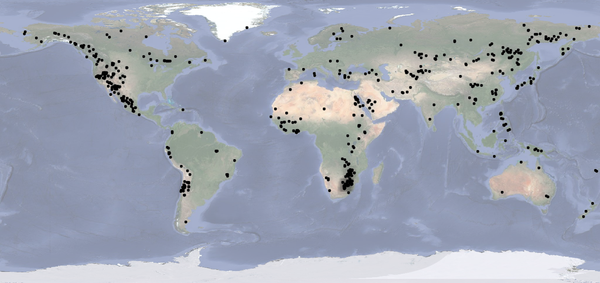

# ⛏ Ore Distribution


This page is for **ADDITIONAL** ore distribution, You can find a majority of ores almost **EVERYWHERE** around the world (Not including Ancient Debris)



All credit goes to MattiBorchers, You can find the original ore distribution page [here](https://earth.motfe.net/additional-ore-global-distribution/)


<figure><figcaption>
Additional Clay Distribution
</figcaption></figure>

<figure><figcaption>
Additional Coal Distribution
</figcaption></figure>

<figure><figcaption>
Additional Copper Distribution
</figcaption></figure>

<figure><figcaption>
Additional Diamond Distribution
</figcaption></figure>

<figure><figcaption>
Additional Gold Distribution
</figcaption></figure>

<figure><figcaption>
Additional Iron Distribution
</figcaption></figure>

<figure><figcaption>
Additiional Ancient Debris (Netherite) Distribution
</figcaption></figure>

<figure><figcaption>
Additional Quartz Distribution
</figcaption></figure>

<figure><figcaption>
Additional Redstone Distribution
</figcaption></figure>


Once again, All credit for MattiBorchers!

