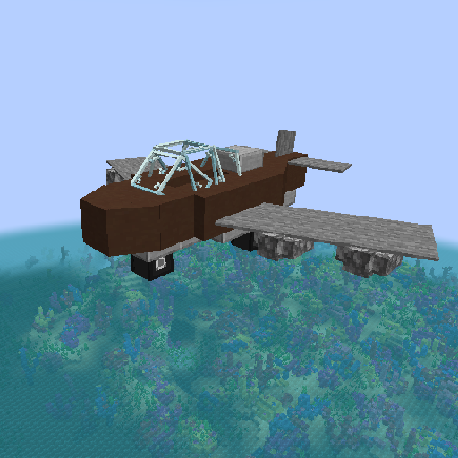
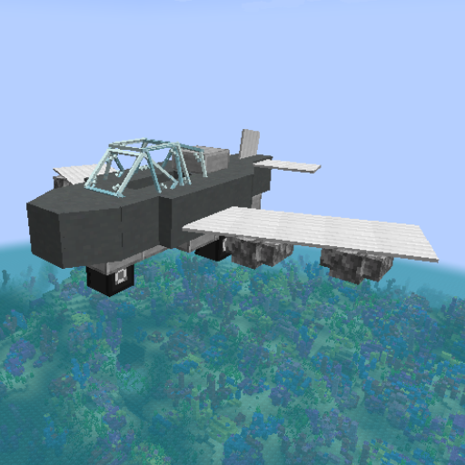
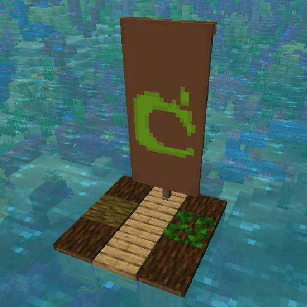
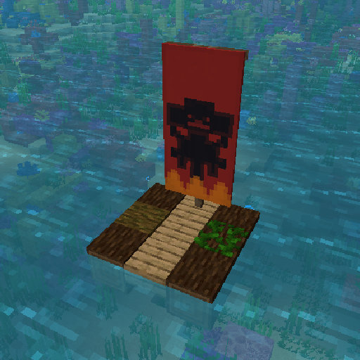
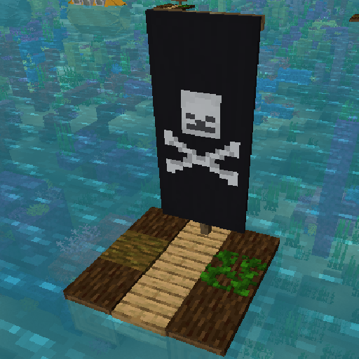
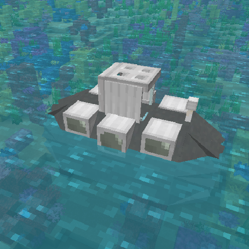
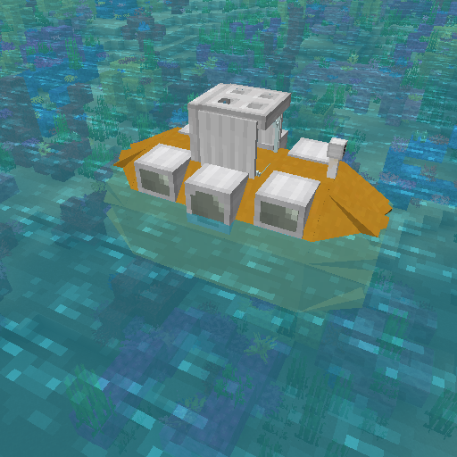
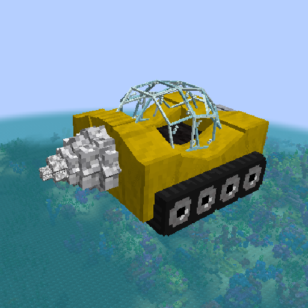
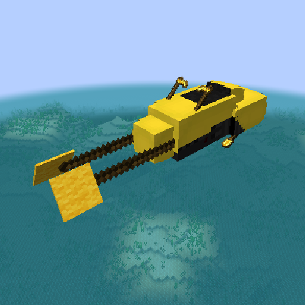

# ✈ Vehicles

## General Controls

Placing/Picking up your Vehicle

Placing: Place down the chest corresponding to your vehicle

\
Picking up: Shift (Crouch) + Right-click on your Vehicle

Refueling your Vehicle

Refueling: Shift (Crouch) + Left click your **PLACED** vehicle to open a menu where you can refuel your vehicle

Obtaining Vehicles

Do /shop and go to the Vehicles Tab. 

## Controls



Right click: Mount\
Shift (Crouch): Dismount\
Right-click (While in plane): Open Storage\
Right-click (Holding TNT) (While in plane): Drop TNT

W: Accelerate\
S: Decelerate\
A/D: Turn Left/Right\
Camera Up/Down: Ascend/Descend

#### How to fly: 1. Right click to mount your plane 2. Look up and Accelerate, Your plane will take off when you reach the correct speed. 3. Hold your Accelerate key and use your camera (Look up/down) to bring your plane up/down while using A and D to control your direction


Be sure to have enough space to take off with your plane, it's recommended to create a runway for your plane.




W: Go Forward\
S: Stop\
A/D: Turn Left/Right\
Space(Hold): Go Up\
Space(release): Go Down\



#### must be placed on rail
W: Go Forward\
S: Stop/Backwards\



W: Go Forward\
S: Stop\
A/D: Turn Left/Right\



# Vehicle Catalog




















